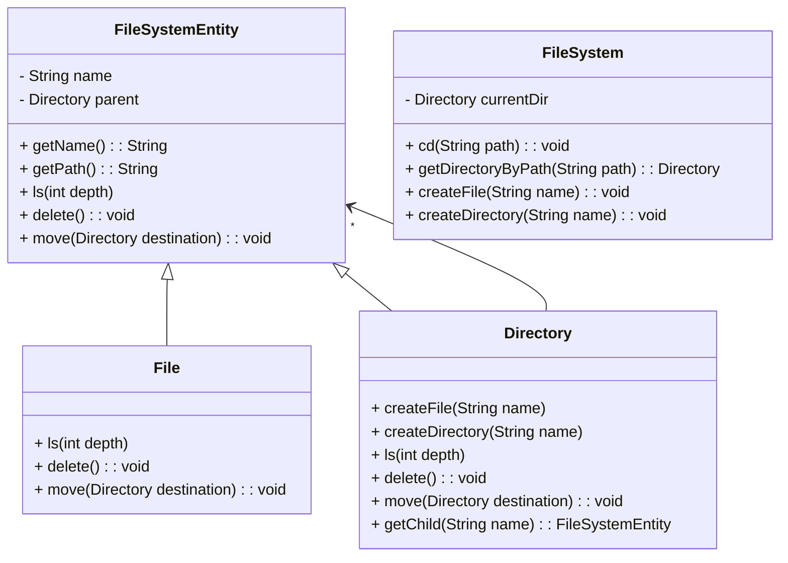

# File System Low-Level Design (Interview Notes)

Objective

Design an in-memory file system that can support basic operations like creating, deleting, moving, searching, and listing files and directories. This solution leverages the Composite Design Pattern to represent the hierarchical nature of files and directories.

## Core Requirements

	1.	Functional Requirements:
	•	Create: Ability to create files and directories.
	•	Delete: Support deleting files and directories (recursively for directories).
	•	Move: Move files or directories within the file system.
	•	Search: Find files or directories by name.
	•	List: Display the contents of a directory, recursively or non-recursively.
	•	Path Navigation: Support both absolute and relative paths.
	2.	Non-Functional Requirements:
	•	Efficiency: Operations like create, delete, and search should be efficient.
	•	Usability: Methods should be intuitive and support hierarchical navigation.
	•	Extendibility: The design should support future additions like file metadata or permissions.
	3.	Constraints and Assumptions:
	•	It is an in-memory system with no persistence.
	•	Directory and file names are unique within the same parent directory.
	•	Root directory cannot be deleted or moved.
	•	The system operates in a single-threaded environment.

## Design Pattern: Composite Design Pattern

The Composite Design Pattern is well-suited for this file system design because it allows treating individual objects (files) and collections of objects (directories) uniformly. Using this pattern:
	•	FileSystemEntity serves as the base component, defining common properties and operations.
	•	File acts as a leaf component with no children.
	•	Directory is a composite component that can contain both files and other directories, enabling recursive operations like listing or deletion.

## Class Diagram




## Core Classes and Responsibilities

	1.	FileSystemEntity (Abstract Base Class):
	•	Defines shared attributes (name, parent) and behaviors (ls, delete, move) for files and directories.
	•	Methods:
	•	getName(): Returns the name of the entity.
	•	getPath(): Builds the full path by recursively accessing parent directories.
	•	ls(int depth): Abstract method for listing contents.
	•	delete(): Abstract method for deleting the entity.
	•	move(Directory destination): Abstract method for moving the entity.
	2.	File (Leaf Component):
	•	Represents an individual file with no children.
	•	Implements ls, delete, and move methods specific to files.
	•	Methods:
	•	ls(int depth): Prints the file name with appropriate indentation.
	•	delete(): Removes the file from the parent’s children.
	•	move(Directory destination): Moves the file to the specified directory.
	3.	Directory (Composite Component):
	•	Represents a directory, which can contain multiple files and subdirectories.
	•	Manages its children in a map for efficient lookups.
	•	Implements recursive operations like listing and deleting.
	•	Methods:
	•	createFile(String name): Adds a new File to the directory.
	•	createDirectory(String name): Adds a new Directory to the directory.
	•	ls(int depth): Lists all contents, recursively if specified.
	•	delete(): Recursively deletes all children before deleting itself.
	•	move(Directory destination): Moves the directory, ensuring no cycles are created.
	4.	FileSystem (Utility Class):
	•	Manages the high-level file system context and interactions.
	•	Maintains a pointer to currentDir and provides methods to change directories and manage files and folders.
	•	Methods:
	•	cd(String path): Changes the current directory based on the given path.
	•	getDirectoryByPath(String path): Returns a directory based on an absolute or relative path.
	•	createFile(String name): Creates a file in currentDir.
	•	createDirectory(String name): Creates a directory in currentDir.

## Key Operations and Pseudo-Code

1. Create Operation

	•	File: Creates a new file as a child of the current directory.
	•	Directory: Creates a new directory within the current directory.
	•	Duplicate Name Check: Ensures names are unique within the same parent.

public void createFile(String name) {
    if (!children.containsKey(name)) {
        children.put(name, new File(name, this));
    }
}

public void createDirectory(String name) {
    if (!children.containsKey(name)) {
        children.put(name, new Directory(name, this));
    }
}

2. Delete Operation

	•	File: Removes itself from the parent directory’s children.
	•	Directory: Recursively deletes all children before deleting itself from the parent.
	•	Edge Cases:
	•	Root directory cannot be deleted.
	•	Handle non-existent entities gracefully.

public void delete() {
    for (FileSystemEntity child : new ArrayList<>(children.values())) {
        child.delete();
    }
    if (parent != null) {
        parent.removeChild(this);
    }
}

3. Move Operation

	•	File: Moves itself to a specified destination directory.
	•	Directory: Moves itself and all children, ensuring no cycles (moving into itself or subdirectories).
	•	Cycle Check: Uses isSubdirectory to prevent cyclic references.

```
public void move(Directory destination) throws Exception {
    if (this == destination || isSubdirectory(destination)) {
        throw new Exception("Cannot move directory into itself or a subdirectory.");
    }
    if (parent != null) {
        parent.removeChild(this);
    }
    destination.addChild(this);
    parent = destination;
}
```

4. Search Operation

	•	Recursive Search: Traverses directories recursively to find entities by name.
	•	Efficiency: Uses the children map for fast lookups within each directory.

```
public FileSystemEntity search(String name) {
    for (FileSystemEntity child : children.values()) {
        if (child.getName().equals(name)) return child;
        if (child instanceof Directory) {
            FileSystemEntity result = ((Directory) child).search(name);
            if (result != null) return result;
        }
    }
    return null;
}
```

5. List Operation (ls)

	•	Non-Recursive: Lists only the immediate children of a directory.
	•	Recursive: Traverses all subdirectories and files.
	•	Path Construction: Uses parent references to construct full paths.

```
public void ls(int depth) {
    System.out.println("  ".repeat(depth) + getName());
    for (FileSystemEntity entity : children.values()) {
        entity.ls(depth + 1);
    }
}
```


6. Path Navigation (cd)

	•	Supports relative (.., .) and absolute paths.
	•	Uses getDirectoryByPath to resolve paths and handle navigation commands.

```
public void cd(String path) {
    Directory targetDir = getDirectoryByPath(path);
    if (targetDir != null) {
        currentDir = targetDir;
    }
}
```

## Error Handling and Edge Cases

	1.	Invalid Operations:
	•	Moving a directory into itself or a subdirectory.
	•	Attempting to delete or move the root directory.
	•	Creating files or directories with duplicate names within the same parent.
	2.	Non-Existent Paths:
	•	Handle non-existent paths by displaying informative messages.
	3.	Cycle Prevention:
	•	Use isSubdirectory to ensure directories are not moved into themselves or their descendants.

## Scalability Considerations

	1.	Concurrency:
	•	Although out of scope here, consider adding synchronization mechanisms for thread safety in a multi-threaded environment.
	2.	Persistence:
	•	To make the file system persistent, integrate a database or file-based storage to save and load data across sessions.
	3.	Optimization:
	•	Use maps for efficient lookups and consider caching frequently accessed directories if the structure becomes large.

## Interview Tips for FAANG-Level

	1.	Explain Composite Pattern:
	•	Emphasize how the Composite Pattern allows treating files and directories uniformly, simplifying recursive operations.
	2.	Discuss Edge Cases:
	•	Mention scenarios like cyclic moves, root directory restrictions, and handling non-existent paths.
	3.	Modular Code Design:
	•	Showcase how each class has a clear, single responsibility. Each component (file, directory, file system) manages its own operations without unnecessary dependencies.
	4.	Optimizations:
	•	Highlight use of data structures (like maps) for efficient lookups and consider discussing scalability if the interviewer asks about larger systems.
	5.	Clear Assumptions and Constraints:
	•	Early in the discussion, clarify assumptions like single-threaded operation, in-memory storage, and file name uniqueness within directories.

This note provides a detailed roadmap for a file system low-level design, covering important topics relevant to FAANG-level interviews, with a focus on robustness, pattern use, and scalability. Let me know if there’s anything specific you’d like to dive into further!
